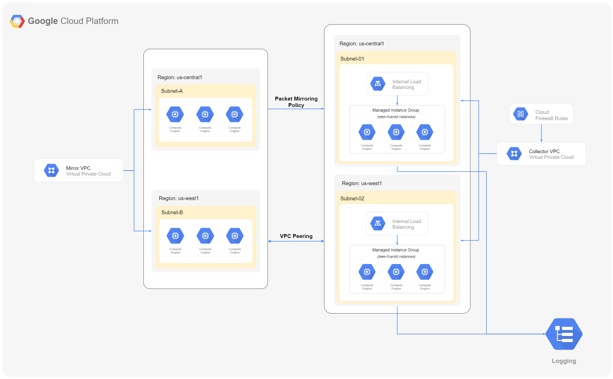

#  Google Zeek Automation Module


This module simplifies the deployment of Zeek so GCP customers can feed raw packets from VPC Packet Mirroring and produce rich security telemetry for threat detection and investigation in our Chronicle Security Platform.


## Compatibility

This module is meant for use with Terraform `v0.13.5` or above.


## Examples

Examples of how to use these modules can be found in the [examples](examples) folder.
- [Basic Configurations](examples/basic_configurations): Demonstrates how to use google zeek automation module with basic configurations.
- [Mirror Resource Filtering](examples/mirror_resource_filtering): Demonstrates how to specify mirror vpc network sources, for packet mirroring policy.
- [Packet Mirroring Traffic Filtering](examples/packet_mirroring_traffic_filtering): Demonstrates how to use traffic filtering parameters for packet-mirroring policy.


## Architecture




## Features

- Creates regional managed instance groups using same network peering between mirror-collector vpc for collecting logs from mirror vpc sources.
- Enables regional packet mirroring policies for mirroring mirror vpc sources like:
    - mirror-vpc subnets
    - mirror-vpc tags
    - mirror-vpc instances

  with optional parametes like: ip_protocols, direction, & cidr_ranges.
- Enables packaging of logs in order to send it to Chronicle Platform.


## Pre-requisites

1. [Packer Image](#packer-image) should exist before running terraform script.
2. Terraform is [installed](#software-dependencies) on the machine where Terraform is executed.
3. The Service Account you execute the module with has the right [permissions](#IAM).
4. The Compute Engine APIs are [active](#enable-apis) on the project you will launch the infrastructure on.
5. User must create a GCS Bucket.
6. If Mirror VPC is in a different project, then the user will have to do the manual network peering from Mirror VPC to Collector VPC, if they want to mirror traffic from that project VPC.
7. If Mirror VPC is in a different project, then the user will have to add an egress firewall rule in the Mirror VPC for redirecting incoming traffic to Collector VPC.


### Packer Image

   There are two ways for using packer image:
   - [Use pre-configured image](#use-pre-configured-image)
   - [Create your own custom image](#create-your-own-custom-image)

#### Use Pre-Configured Image
- One can use our pre-configured packer image which is published on GCP and publicly available to all.
- We have already configured our packer image with terraform script by configuring variable [`golden_image`](#inputs). (i.e. `projects/zeekautomation/global/images/zeek-fluentd-golden-image-v1`)

#### Create Your Own Custom Image
- One can make their own custom image by following [this](packer/README.md) documentation.
- Once the custom image is created, change the [`golden_image`](#inputs) variable value with your custom image name to use it in terraform script.


### IAM
Service account or [user credentials][user-credentials] with the following roles must be used to provision the resources of this module:

- Service Account User - `roles/iam.serviceAccountUser`
- Service Account Token Creator - `roles/iam.serviceAccountTokenCreator`
- Compute Admin - `roles/compute.admin`
- Compute Network Admin - `roles/compute.networkAdmin`
- Compute Packet Mirroring User - `roles/compute.packetMirroringUser`
- Compute Packet Mirroring Admin - `roles/compute.packetMirroringAdmin`
- Logs Writer - `roles/logging.logWriter`
- Monitoring Metric Writer - `roles/monitoring.metricWriter`
- Storage Admin - `roles/storage.admin`

**In addition to above roles, for Mirror VPCs residing in different projects than Collector VPC, the Service account email used for provisioning Collector VPC resources must be added as IAM Member to respective Mirror VPC project with the following role:**

- Compute Packet Mirroring Admin - `roles/compute.packetMirroringAdmin`

### Enable APIs
In order to operate with the Service Account you must activate the following APIs on the project where the Service Account was created:

- Compute Engine API - `compute.googleapis.com`
- Service Usage API - `serviceusage.googleapis.com`
- Identity and Access Management (IAM) API - `iam.googleapis.com`
- Cloud Resource Manager API - `cloudresourcemanager.googleapis.com`
- Cloud Logging API - `logging.googleapis.com`
- Cloud Monitoring API - `monitoring.googleapis.com`
- Cloud Storage API - `storage.googleapis.com`


## Usage

```tf
module "google_zeek_automation" {
  source                = "<link>/google_zeek_automation"
  gcp_project           = "collector_project-123"

  collector_vpc_name    = "collector-vpc"
  subnets = [
    {
      mirror_vpc_network          = "projects/mirror-project-123/global/networks/test-mirror"
      collector_vpc_subnet_cidr   = "10.11.0.0/24"
      collector_vpc_subnet_region = "us-west1"
    },
  ]

  mirror_vpc_subnets = {
    "mirror-project-123--mirror_vpc_name--us-west1" = ["projects/mirror-project-123/regions/us-west1/subnetworks/subnet-01"]
  }

}
```
**Note: For packet mirroring policy, it requires a mirror source to be specified before running the script. So, out of 3 variables: `mirror_vpc_instances` | `mirror_vpc_tags`| `mirror_vpc_subnets`, at least one of them should be specified while running the terraform script.**

Then perform the following commands on the root folder:
- `terraform init` to get the plugins
- `terraform plan` to see the infrastructure plan
- `terraform apply` to apply the infrastructure build
- `terraform destroy` to destroy the built infrastructure


## Software Dependencies

### Terraform and Plugins
- [Terraform][terraform-download] v0.13.5
- [Terraform Provider for GCP][terraform-provider-google] v3.55

<!-- BEGINNING OF PRE-COMMIT-TERRAFORM DOCS HOOK -->
## Inputs

| Name | Description | Type | Default | Required |
|------|-------------|------|---------|:--------:|
| auto\_create\_subnetworks | When set to true, the network is created in 'auto subnet mode' and it will create a subnet for each region automatically across the 10.128.0.0/9 address range. When set to false, the network is created in 'custom subnet mode' so the user can explicitly connect subnetwork resources. | `bool` | `false` | no |
| cidr\_ranges | IP CIDR ranges that apply as a filter on the source (ingress) or destination (egress) IP in the IP header. Only IPv4 is supported. | `list(string)` | `[]` | no |
| collector\_vpc\_name | Portion of name to be generated for the VPC network. | `string` | n/a | yes |
| delete\_default\_internet\_gateway\_routes | If set, ensure that all routes within the network specified whose names begin with 'default-route' and with a next hop of 'default-internet-gateway' are deleted | `bool` | `false` | no |
| direction | Direction of traffic to mirror. Default value: "BOTH" Possible values: ["INGRESS", "EGRESS", "BOTH"] | `string` | `"BOTH"` | no |
| export\_local\_custom\_routes | Export custom routes to peer network from local network. | `bool` | `false` | no |
| export\_peer\_custom\_routes | Export custom routes to local network from peer network. | `bool` | `false` | no |
| golden\_image | This is name of zeek-fluentd packer image | `string` | `"projects/zeekautomation/global/images/zeek-fluentd-golden-image-v1"` | no |
| ip\_protocols | Protocols that apply as a filter on mirrored traffic. Possible values: ["tcp", "udp", "icmp"] | `list(string)` | `[]` | no |
| machine\_type | This is instance template machine type. | `string` | `"e2-medium"` | no |
| mirror\_vpc\_instances | Mirror VPC Instances list to be mirrored. | `map(list(string))` | `{}` | no |
| mirror\_vpc\_subnets | Mirror VPC Subnets list to be mirrored. | `map(list(string))` | `{}` | no |
| mirror\_vpc\_tags | Mirror VPC Tags list to be mirrored. | `map(list(string))` | `{}` | no |
| mtu | The network MTU. Must be a value between 1460 and 1500 inclusive. If set to 0 (meaning MTU is unset), the network will default to 1460 automatically. | `number` | `0` | no |
| private\_ip\_google\_access | When enabled, VMs in this subnetwork without external IP addresses can access Google APIs and services by using Private Google Access. | `bool` | `true` | no |
| project\_id | GCP Project Id | `string` | n/a | yes |
| subnets | The list of subnets being created | <pre>list(object({<br>    mirror_vpc_network          = string<br>    collector_vpc_subnet_cidr   = string<br>    collector_vpc_subnet_region = string<br>  }))</pre> | n/a | yes |
| template\_description | This is instance template description. | `string` | `"This instance template is used to create zeek-fluentd instances."` | no |
| vpc\_description | The description of the VPC Network. | `string` | `"This is collector VPC network."` | no |
| vpc\_routing\_mode | Routing mode of the VPC. A 'GLOBAL' routing mode can have adverse impacts on load balancers. Prefer 'REGIONAL'. | `string` | `"REGIONAL"` | no |

## Outputs

| Name | Description |
|------|-------------|
| autoscaler\_ids | Autoscaler identifier for the resource with format projects/{{project}}/regions/{{region}}/autoscalers/{{name}} |
| collector\_vpc\_network\_id | The identifier of the VPC network with format projects/{{project}}/global/networks/{{name}}. |
| collector\_vpc\_subnets\_ids | Sub Network identifier for the resource with format projects/{{project}}/regions/{{region}}/subnetworks/{{name}} |
| forwarding\_rule\_ids | Forwarding Rule identifier for the resource with format projects/{{project}}/regions/{{region}}/forwardingRules/{{name}} |
| health\_check\_id | Health Check identifier for the resource with format projects/{{project}}/global/healthChecks/{{name}} |
| intance\_group\_ids | Managed Instance Group identifier for the resource with format {{disk.name}} |
| intance\_groups | The full URL of the instance group created by the manager. |
| intance\_template\_ids | Instance Templates identifier for the resource with format projects/{{project}}/global/instanceTemplates/{{name}} |
| loadbalancer\_ids | Internal Load Balancer identifier for the resource with format projects/{{project}}/regions/{{region}}/backendServices/{{name}} |
| packet\_mirroring\_policy\_ids | Packet Mirroring Policy identifier for the resource with format projects/{{project}}/regions/{{region}}/packetMirrorings/{{name}} |

<!-- END OF PRE-COMMIT-TERRAFORM DOCS HOOK -->

#### Specifying credentials

The Google Zeek Automation uses external scripts to perform a few tasks that are not implemented
by Terraform providers. Because of this the Google Zeek Automation needs a copy of service account
credentials to pass to these scripts. Credentials can be provided via two mechanisms:

1. Explicitly passed to the Google Zeek Automation with the `credentials` variable. This approach
   typically uses the same credentials for the `google` provider and the Google Zeek Automation:
    ```terraform
    provider "google" {
      credentials = "${file(var.credentials)}"
    }

    module "google_zeek_automation" {
      source = "<link>/google_zeek_automation"

      # other variables follow ...
    }
    ```
2. Implicitly provided by the [Application Default Credentials][application-default-credentials]
   flow, which typically uses the `GOOGLE_APPLICATION_CREDENTIALS` environment variable:
   ```terraform
   # `GOOGLE_APPLICATION_CREDENTIALS` must be set in the environment before Terraform is run.
   provider "google" {
     # Terraform will check the `GOOGLE_APPLICATION_CREDENTIALS` variable, so no `credentials`
     # value is needed here.
   }

   module "google_zeek_automation" {
      source = "<link>/google_zeek_automation"

      # Google Zeek Automation will also check the `GOOGLE_APPLICATION_CREDENTIALS` environment variable.
      # other variables follow ...
   }
   ```

## Learn

### Core concepts

- [VPC Network](docs/core-concepts/core-concepts.md#vpc-network)
- [Network Subnets](docs/core-concepts/core-concepts.md#network-subnets)
- [Network Firewall](docs/core-concepts/core-concepts.md#network-firewall)
- [VPC Network Peering](docs/core-concepts/core-concepts.md#vpc-network-peering)
- [Instance Template](docs/core-concepts/core-concepts.md#instance-template)
- [Managed Instance Group](docs/core-concepts/core-concepts.md#managed-instance-group)
- [Internal Load Balancer](docs/core-concepts/core-concepts.md#internal-load-balancer)
- [Packet Mirroring](docs/core-concepts/core-concepts.md#packet-mirroring)


### Repo organisation

This repo has the following folder structure:

- [examples](./examples): This folder contains examples of how to use the module.

- [files](./files): This folder contains startup script file.

- [packer](./packer): To generate your own packer image.

- [test](./test): Automated tests for the module.


## Contributions

Contributions to this repo are very welcome and appreciated! If you find a bug or want to add a new feature or even contribute an entirely new module, we are very happy to accept pull requests, provide feedback, and run your changes through our automated test suite.

Please see [contributing guidelines](CONTRIBUTING.md) for information on contributing to this module.


## Troubleshooting

- If you get error: `Error: Error waiting for Adding Network Peering: An IP range in the peer network (X.X.X.X/X) overlaps with an IP range in the local network (X.X.X.X/X) allocated by resource (projects/<project-id>/regions/<region>/subnetworks/<subnet-id>).`

  **Reason:** A subnet CIDR range in one peered VPC network cannot overlap with a static route in another peered network. This rule covers both subnet routes and static routes. <br>
  Refer: https://cloud.google.com/vpc/docs/vpc-peering#restrictions

  **Solution**:
    Users should establish a new configuration with mirror VPCs whose CIDR ranges clash with those of the present infrastructure. Following that, a new collector VPC will be launched, as well as a new set of mirror VPCs will be mirrored, which will resolve the overlapping CIDR problem.

[terraform-download]: https://www.terraform.io/downloads.html
[terraform-provider-google]: https://github.com/terraform-providers/terraform-provider-google
[application-default-credentials]: https://cloud.google.com/docs/authentication/production#providing_credentials_to_your_application
[user-credentials]: https://cloud.google.com/sdk/gcloud/reference/auth/login
